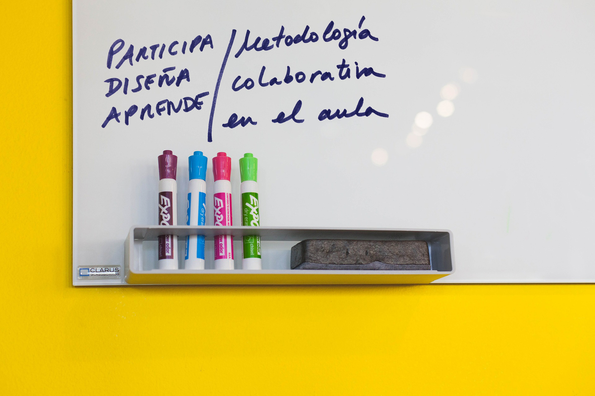
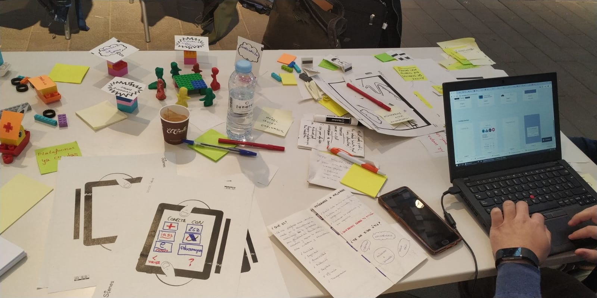
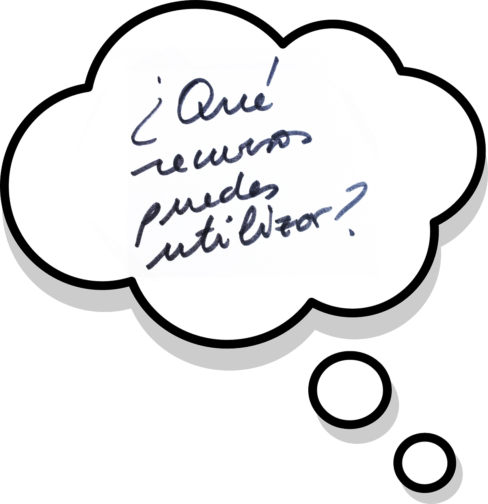

# Introducción: {#introducci-n3}

“Participa, diseña, y aprende”: Metodología colaborativa en el aula

Durante los cursos 2015-16 y 2016-17 realicé, en colaboración con estudiantes que realizaban su TFG (Trabajo Fin de Grado), encuestas dirigidas al alumnado y sus docentes, sobre el servicio formativo que ofrecía para jóvenes estudiantes.

Todos los chicos y chicas de ESO y Bachillerato que participaron en nuestras actividades durante esos dos cursos, contestaron a las encuestas de valoración de las actividades dándonos muchas pistas para ir mejorándolas.

Lo que más me llamó la atención del resultado de la investigación fue que prácticamente en todos los cuestionarios se repetía la misma palabra una y otra vez: **participación**. ¿Qué es lo que más te ha gustado de la actividad?: “Que he podido participar”. ¿Qué es lo que te gustaría mejorar de la actividad? “Más participación”

Una cosa me quedó clara, ellos y ellas no quieren ser sujetos pasivos, quieren ser protagonistas.

Por eso el título de este bloque se basa en tres conceptos y el primero de ellos es la participación. El segundo: diseño (el cómo, el medio) y el tercero: aprendizaje (el objetivo, el fin). Creo que los tres pueden ir de la mano cuando aplicamos Design Thinking en el aula.

En este bloque vamos a poder conocer la metodología adaptada al entorno educativo.

Mi experiencia como facilitadora de Design Thinking en el entorno educativo se centra en las experiencias que he vivido en el aula con alumnado de ESO y Bachillerato principalmente; si bien, la metodología que ahora conocerás puede aplicarse a cualquier contexto educativo o formativo.

Además, puede aplicarse con alumnado o con toda la comunidad educativa.

Dependerá de vuestros objetivos y de cómo la apliquéis o la vayáis integrando en vuestro día a día, proyectos, programas de innovación, etc. tendrá más o menos alcance.

Para empezar a trabajar en el aula necesitamos unos recursos. No son costosos ni difíciles de conseguir. Reflexionar sobre ellos nos ayudará a interiorizar que tipo de dinámicas vamos a ir construyendo.

No solo reflexionaremos sobre recursos en este bloque, también quisiera compartir con vosotros unos principios en forma de decálogo que he ido observando a lo largo de los años. Entiendo que muchos de vosotros y vosotras habréis percibido que facilitan el trabajo colaborativo y la comunicación en el aula.

La idea es que este decálogo nos anime a construir poco a poco, clase a clase, proyecto a proyecto, y entre todas las personas que comparten el espacio del aula, un entorno que favorezca la innovación.

En este bloque podéis ver que la metodología se puede aplicar poco a poco, comenzando con pequeñas experiencias, alguna actividad que nos ayude a introducir un tema o una práctica, un taller en el que experimentar todo el proceso de modo sintético, o todo un proyecto en el que llegar, porque no, a la implementación de alguna solución.

Todo este “entrenamiento” favorecerá que este modo de pensar, de abordar los temas que se nos presentan, los retos; sea interiorizado por todos los actores involucrados en el proceso de aprendizaje y vaya aplicándose de una forma natural, hasta que forme parte de nuestra forma común de trabajar.

Para ilustrar este recorrido por los niveles de aplicación, mostraré diferentes casos de éxito de su aplicación en centros educativos.

**Contenidos**:

- Recursos

- Principios: decálogo

- Metodología

- Niveles de aplicación

- Resultados. Casos de éxito

---

**Ejercicio de 2 minutos:**

Si miras a tu alrededor te darás cuenta que tenemos muchos materiales y recursos para trabajar. A lo mejor no tienes una impresora 3D, o una cabina de pintura…, pero podemos hacer mucho con lo que nos rodea, ¿no crees?

**¿Tienes material a tu disposición para diseñar? **Haz una lista, probablemente será larga!

O quizás no necesites mucho!

**_“ Hay un montón de problemas en la educación hoy…, pero cada uno de estos problemas puede verse como una oportunidad”_**

DT para educadores. IDEO