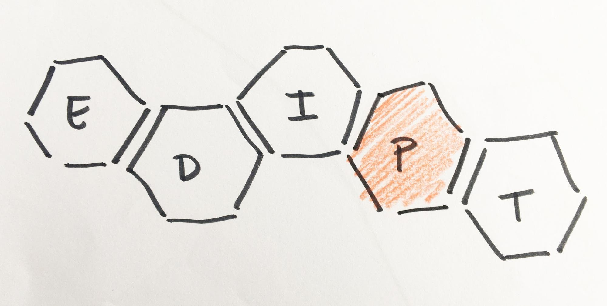
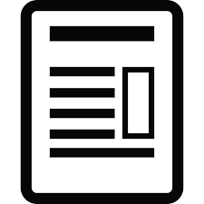

# Metodología3 {#metodolog-a3}

Ante todo, este es un sistema para aprender.

Al principio querrás aplicarlo “al pie de la letra” para poco después, y según el proyecto en el que trabajes y las características del alumnado, ir modificando, adaptando, puliendo y haciendo el proceso totalmente tuyo, ¡y de tu alumnado!

Como indica la imagen de la pirámide, podéis iniciar un camino, desde el entrenamiento de herramientas y metodologías hasta la participación real del alumnado (co-creación) en el entorno y ecosistema de la comunidad educativa.

¿Cómo debe ser la actividad?

En equipo: Colaborativo (equipos de 5-6 personas) + un dinamizador (puedes ser tú mismo, si te entrenas en la metodología)

Duración:

De menos a más:

1- Ejercicios y herramientas

Antes de proponer un taller o proyecto a tu alumnado te propongo que entrenes junto a ellos diferentes herramientas o plantees pequeños ejercicios que ayudarán a entrenar habilidades que serán clave en el proceso: un brainstorming (ENLACE PRESENTACIÓN 1 BLOQUE 5) para comenzar cualquier tema de estudio (¿qué sabemos sobre los romanos?), analizar un tema y extraer las conclusiones más relevantes (sobre algo que nos interese, un tema de la comunidad educativa, del barrio), generar diferentes vías o retos para abordar un tema (¿cómo podemos abordar el estudio del tema 6?), realizar pequeñas maquetas, muy rápidas sobre ideas…

Realizaremos los ejercicios durante un periodo de tiempo que se ajuste a las necesidades de nuestro alumnado y a la programación general: una herramienta, una “píldora” teórica sobre una fase con un pequeño ejercicio, dinámicas para facilitar la creatividad,etc.

En los dos últimos bloques del curso podrás encontrar distintas herramientas o dinámicas que podrás ir integrando en vuestro día a día.

2- Taller de iniciación de 50 minutos

3- Taller: Dinámica de 2 a 4 sesiones de 50 minutos

4- Proyecto: Actividad de al menos 8 sesiones de 50 minutos

Es recomendable comenzar con un taller, para poco a poco, y con la experiencia adquirida podamos abordar un proyecto.

Objeto: Diseño o re-diseño de producto, espacio, servicio, material didáctico, aula, y todo lo que se os ocurra.

Es conveniente, en la medida de lo posible, que el tema sobre el que trabajar u objeto a diseñar lo decida el alumnado con las sugerencias de las personas adultas. Si queremos potenciar la participación y proactividad en nuestro alumnado debemos ofrecer cauces para trabajar los temas que les motivan e interesan.

Principios: Además de trabajar el decálogo, es importante despertar en el alumnado el interés por aprender y aportar a su entorno.

Metodología adaptada: 

La metodología que presento en este bloque es un resumen/simplificación.

Nos hemos quedado con la esencia de procesos de diseño formulados por organizaciones especializadas en diseño a nivel mundial como son el doble diamante del Design Council de U.K.y el enfoque de la Universidad de Strandford, (que ya hemos podido conocer en el primer bloque del curso) y después de experimentarlos con alumnado, de prototipar herramientas y testar su aplicación; y ver las carencias, excesos, etc. en los que se podía incurrir; hemos ido puliendo, seleccionando herramientas, simplificando algunos pasos (que no eliminando) para adaptarnos a nuestro público objetivo: docentes y alumnado.

Es importante hacer énfasis en que, tal como podemos visualizar en el doble diamante representado en las ilustraciones, la metodología que os presentamos es divergente y convergente.

Es divergente en e la primera fase de trabajo (1- INVESTIGAR) en la que nos abrimos al ecosistema en el que estamos trabajando, y en la tercera (3- IDEAR), en la que generamos ideas de solución.

Es convergente en la segunda fase (2- ENFOCAR), en la que definimos un reto, y en la última (4- PROTOTIPAR Y TESTAR), en la que seleccionamos una idea y la hacemos tangible realizando prototipos que vamos testando y evolucionando.

“Participa, diseña, y aprende”

Metodología colaborativa en el aula

Fase 1- INVESTIGAR

Empatía y lupa:  Planificación · Búsqueda · Análisis · Síntesis · Empatía · Comunicación

(Divergente)

En esta fase es interesante que el alumnado entienda que hay que comprender los problemas profundizando en las necesidades de las personas.

Fase 2- ENFOCAR

¿Cómo podríamos?: Pensamiento lateral · Síntesis · Espíritu crítico · Liderazgo · Comunicación

(Convergente)

Con base a las conclusiones de investigación planteamos varias vías de trabajo.

En esta fase somos capaces de detectar diversos caminos para abordar el tema de trabajo, aprendemos a elaborar diferentes retos y a seleccionar uno.

Fase 3- IDEAR

(Divergente)

Tú también eres creativo, ¿entrenamos?: Creatividad · Resolución de problemas · Improvisación · Comunicación

Ahora, que entendemos a las personas usuarias y hemos identificado un reto, es cuando podemos desplegar todo nuestro ingenio. Es importante generar muchas ideas en equipo, cuantas más, mejor.

Fase 4- PROTOTIPAR Y TESTAR

(Convergente)

Hazlo sencillo para poder hacerlo mejor: Representación en 2 y 3 dimensiones · Percepción visual · Improvisación · Aprender de los errores

El equipo visualiza las soluciones, representa las ideas de la manera más directa y sencilla posible. Mejoraremos el prototipo y lo testaremos hasta que esté más refinado.

PRESENTAR:

Entre todos lo podemos comunicar

El equipo presenta su idea como equipo. Como parte del trabajo colaborativo, se elabora una presentación visual y un guión para la presentación verbal.

Se hace énfasis en transmitir las claves del trabajo realizado, el proceso, las decisiones tomadas, el resultado y la esencia de lo que el equipo aporta con la idea que presenta.

Todos los miembros del equipo participan en la presentación.

IMPLEMENTAR:

Hasta hacerlo realidad

El equipo continúa el proceso de diseño del producto, la actividad, el servicio, material didáctico…; desde el concepto presentado hasta hacerlo realidad.

Cuenta con el apoyo de la comunidad educativa, que colabora en su implantación.

El equipo ha podido diseñar un producto para fabricarlo con la impresora 3D del centro o ha podido diseñar el concepto de una actividad para poner en marcha en el centro contando con la participación de la comunidad educativa, por ejemplo.

Sea lo que sea, se puede implementar.

Hace falta pulir los prototipos, dibujar las piezas mediante programas informáticos, buscar una plataforma gratuita para hacer un blog, una web o abrir una cuenta en una red social, diseñar los carteles, pensar en los procesos y la organización.

Si hay apoyo por parte de la comunidad educativa se puede conseguir.

Mostraremos a continuación la metodología fase a fase mediante tres ejemplos de aplicación:

1- Actividad de iniciación: Taller “Crea con Tangram” (1 sesión)

Dinámica diseñada por Paloma de la Cruz en su TFG con el Cadi.

Se trata de una experiencia que se basa en el juego denominado Tangram.

Con base a una figura construida el equipo llega a definir un tema de trabajo, detecta problemas y genera ideas de solución.

Es una herramienta creativa que nos permite conocer todas las fases de la metodología de manera abreviada y lúdica.

2- Actividad básica: Taller diseño objeto (2 sesiones)

Se trata de un taller en el que mejorar un objeto que ya existe.

En este caso pondré el ejemplo de un mando de tv, pero podría ser cualquier objeto que pudiera ser adecuado para el alumnado: un juguete, una cubertería, un ratón de ordenador…

3- Actividad avanzada: Proyecto de Design Thinking y participación (A partir de 8 sesiones)

El tema del proyecto es elegido por el alumnado de entre sus intereses.

El resultado es la definición de un servicio, espacio, actividad, proceso, dinámica. El objetivo de esta actividad es que posibilite al alumnado la implementación de una solución.