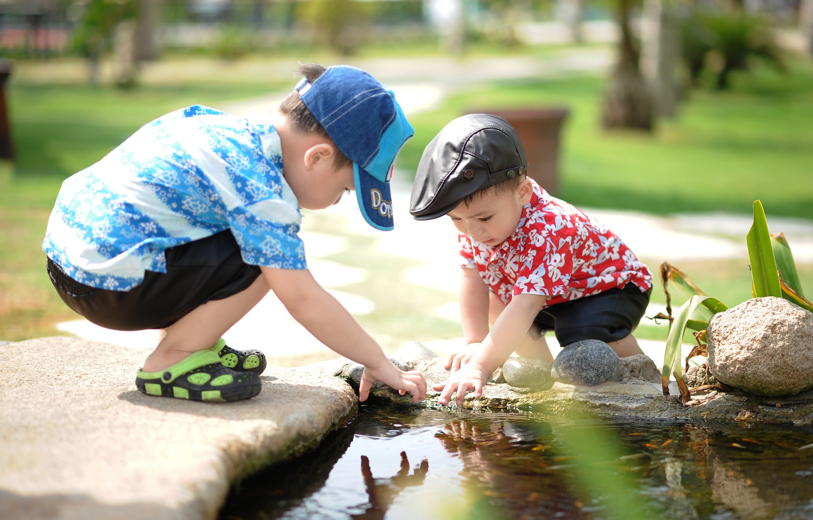
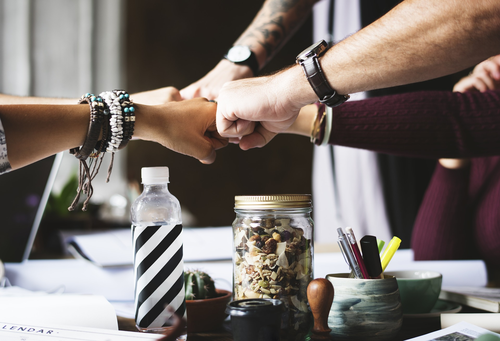

# Niveles de aplicación3: {#niveles-de-aplicaci-n3}

Ejemplos:

1- Actividad de iniciación:  Taller Crea con Tangram

(Material didáctico diseñado por Paloma de la Cruz en su TFG: Diseño de exposición participativa ¡WOW! Diseño)

Taller creativo

Tiempo estimado: 50 minutos

Para todas las edades

Equipos de 4-6 integrantes + 1 facilitador

“Crea con Tangram”: Un taller para empezar a entender el diseño sin saber que lo que estás haciendo es diseñar.

Permite que alumnos de cualquier edad, con ayuda de un facilitador, puedan seguir las fases de diseño de una forma dinámica y rápida.

Es la práctica que recomiendo para que cualquier persona comience a sumergirse en la metodología de diseño.

NOTA: Para seguir esta parte de la explicación sería interesante que contarais con un ejemplar de la herramienta en papel (enlace al pdf) para poder ir viendo los pasos mientras los explico o que abráis el pdf y lo tengáis en pantalla. También os sugiero que leáis el documento Guía para docentes (enlace al pdf)

(NOTA PARA JOSÉ: LOS PDF ESTÁN EN ARCHIVOS DE REFERENCIA y en la carpeta del bloque 3 de tareas)

Casos de aplicación crea con Tangram:

Desde el curso 2018-19 he facilitado este taller a personas de diferentes edades, diferentes niveles académicos, en contextos diversos. Desde niños de 8 años hasta adultos especializados en diseño y formación. Al ser una herramienta muy abierta, se adapta al punto de vista y conocimiento del participante.

1- INVESTIGAR (divergente):

Es la propia dinámica la que nos ofrece, al azar, un tema sobre el que trabajar (que parte de la figura que el equipo forma con el puzle). 

Al tratarse de una dinámica de introducción la fase de investigación está muy simplificada.

Una vez recortado el Tangram, todos los miembros del equipo colaborativamente forman una figura con todas las piezas. Puede representarse un animal, una persona, un objeto, un paisaje...No es necesario que sea una figura muy pensada, lo que salga espontáneamente mientras todos van colocando piezas servirá.

La figura resultante dará pie al tema general a trabajar.

Comenzamos a leer las instrucciones del juego escritas en la parte posterior de cada una de las piezas del puzle. Los dos primeros pasos hacen referencia a la fase de investigación.

Paso 1: PUNTO DE PARTIDA: ¡Rápido! Que alguien cuente una historia inspirada en la imagen.

Uno de los participantes cuenta una historia improvisada, espontánea. De esta forma se hacen palpables los miedos, incertidumbres o preocupaciones de la persona que los cuenta, que están inspirados en su experiencia y su entorno. El resto del equipo puede participar completando o matizando la historia.

Paso 2: CONCLUSIONES INVESTIGACIÓN: Pensad individualmente algunos problemas que puedan existir alrededor de esa historia. ¡Apuntadlos!

En este paso se realiza individualmente un listado de problemas para después ponerlo en común. Simula la investigación que finaliza con la elaboración de unas conclusiones.

2- ENFOCAR (convergente):

Paso 3: LLUVIA DE RETOS: Describid mejor uno de esos problemas. ¿A qué se debe? ¿A qué o quién afecta y cómo? Preguntaos: ¿Cómo podríamos…?

Cada equipo elige uno de los problemas. Todo el equipo está de acuerdo en el problema que quiere ayudar a solucionar. Profundizamos un poco más en el problema, pensando cuál es su origen, a quiénes afecta y cómo. Cuando tenemos respuestas para todas estas preguntas comenzamos a pensar en posibles retos. ¿Cómo podríamos…? Pensaremos en varios retos, para finalmente seleccionar por consenso uno de ellos.

3- IDEAR (divergente)

Paso 4: Dibujad ideas originales que solucionarían el problema o parte de él.

Cada participante comienza a dibujar esquemas sencillos y bocetos sobre ideas para solucionar el reto seleccionado.

Paso 5: ¡Volved a la tierra! ¿De qué forma alguna de estas ideas podría convertirse en un producto o un servicio que no exista? Explicadlo bien.

Las ideas se ponen en común, se analiza su viabilidad (por eso lo de volved a la tierra), se debate brevemente sobre su idoneidad y se selecciona una de ellas, la que podría convertirse en un producto o un servicio innovador.

A continuación se desarrolla un poco más, se hacen dibujos un poco más detallados, con flechas indicativas, anotaciones, alternativas, etc.

4- PROTOTIPAR Y TESTAR (convergente)

Paso 6: Desarrollad una idea: dadle forma, pensad en los materiales… Podéis hacer un prototipo que os ayude a probar vuestra idea.

Durante este paso definimos la forma, el tamaño, las funciones, componentes,el proceso básico (si se trata de un servicio)

Paso 7: Buscad la opinión de vuestros usuarios. Hablad con otras personas y preguntadles qué les parece el concepto.

Durante este paso muestran el prototipo a compañeros de otros equipos para detectar áreas de mejora de la idea.

La actividad finaliza con una presentación verbal de la idea por parte de los equipos.

El docente es el animador del proceso educativo, y es el responsable de imaginar, crear y preparar las situaciones de aprendizaje en que va a poner a sus estudiantes para que ellos construyan el conocimiento.

Duilio Manuel Baltodano González

2- Taller rediseño de mando de tv

Taller mejora de producto existente. Re-diseño

Tiempo estimado: 2- 3 sesiones de 50 minutos

ESO y Bachillerato

Equipos de 4-6 integrantes + 1 facilitador

¿Por qué un mando de televisión?

Para la realización de este taller es conveniente elegir un producto de uso cotidiano.

Es mejor comenzar con algo con lo que estemos familiarizados y que además sea un producto que utilizan muchos tipos diferentes de usuarios, para poder ponernos en la piel de diferentes personas. Recuerda que no diseñamos para nosotros mismos.

1- Investigar (divergente):

Investigación previa individual:

Pedimos al alumnado que haga una investigación previa sobre el tema, en este caso sobre los mandos de tv. Les pedimos que respondan por escrito a las siguientes preguntas, buscando información o fijándose en el mando de tv de su casa: ¿Sabes para que se utilizan todos los botones?, ¿Son adecuados para todas las personas?, ¿Se te ha resbalado, se te ha caído alguna vez?

De esta forma comenzamos la actividad con algo de información sobre el tema que vamos a tratar.

Puesta en común:

La dinámica en el aula comienza con la puesta en común de lo que los integrantes del grupo han encontrado para empezar a profundizar sobre el tema.

Herramienta: panel de conclusiones (ENLACE PRESENTACIÓN 1 BLOQUE 4):

Para ello, dividimos una hoja A3 en varias columnas, habitualmente en tres: tipos de usuarios, contextos de utilización y necesidades no cubiertas.

De este modo hacemos un panel visual con lo que sabemos del tema, a modo de conclusiones.

El objetivo de esta herramienta de resumen es que visualicen que puede haber diferentes caminos para abordar cualquier proyecto y que pueden plantear diferentes retos.

Lo completamos en equipo de la siguiente forma:

 Con esta dinámica potenciamos la empatía

2- Enfocar:

Elegimos un tipo de usuario: niños, ancianos.. o varios: para toda la familia. Elegimos un contexto: el hogar, el profesional, hostelería.. y 3 necesidades no cubiertas que queremos solucionar para la tipología de usuario o usuarios seleccionados.

Sabemos que podríamos profundizar mucho más en el conocimiento de los usuarios, pero solo estamos entrenando.

Una vez hemos reflexionado sobre el panel de conclusiones observando que carencias, problemas, necesidades, tienen los distintos tipos de usuario; elegimos por consenso: una tipología de usuario, un contexto o contextos de utilización y tres aspectos que queremos mejorar.

Escribimos lo que hemos elegido por consenso en un documento A4, que llamamos “panel del reto”

Herramienta: Panel reto.(ENLACE PRESENTACIÓN 2 BLOQUE 4)

Ejemplo: 

Reto: ¿Cómo podríamos diseñar un mando específico para niños de 3 a 8 años, que ofreciera otras funciones, fuera robusto…?

Ahora ya sabemos qué queremos conseguir.

Si no hubiéramos trabajado esta fase no sabríamos cuáles son las necesidades no cubiertas de las personas, no sabríamos todo lo que podemos mejorar en un mando de tv.. nos habríamos puesto a trabajar pensando en diseñar un mando para nosotros.

3- Idear

Utilizamos un soporte A3 para ir colocando, mediante notas adhesivas las diferentes ideas que nos van surgiendo.

Herramienta: panel de ideas (ENLACE PRESENTACIÓN 1 BLOQUE 5) 

Volvemos a utilizar un papel grande, con un A3 será suficiente. hacemos 7 columnas: uso, funciones, ergonomía, materiales, medioambiente, contexto y forma. En cada una de las categorías empezamos a colocar notas adhesivas con todas las ideas que se nos ocurran.

Con este panel simplificamos la técnica de lluvia de ideas, de forma que las ideas ya las ordenamos en categorías y no tenemos que clasificarlas a posteriori.

Herramienta: propuesta individual (ENLACE PRESENTACIÓN 1 BLOQUE 5) 

Cada persona elige una idea del panel de las ideas (suele ser una hibridación de soluciones formales y funcionales) y realiza un dibujo a tamaño real de la idea (un dibujo de perspectiva o las vistas que sean necesarias para entender el producto, del interface, etc.) Se hace una puesta en común y una vez analizadas las ideas, haciendo referencia al reto, se selecciona una de ellas para desarrollarla entre todos los miembros del equipo.

Una vez están dibujadas las ideas se ponen en común. Cada participante tendrá dos minutos para explicar su idea, sus características principales.

El equipo debate brevemente, hasta que es capaz de seleccionar una de las ideas para ser desarrolladas. A veces sucede que se seleccionan características, soluciones o detalles de varias ideas, formando una idea nueva.

En este momento se recuerda al equipo que las ideas son del equipo. Cada persona explica las que le parecen mejores y el motivo. En principio, se elige por consenso.

Tabla de valoración (ENLACE PRESENTACIÓN 1 BLOQUE 5) 

Para facilitar la elección se puede utilizar la herramienta “ tabla de valoración”.

En ella escribiremos los aspectos más importantes a tener en cuenta con base al reto seleccionado y puntuamos cada una de las ideas respecto a esos aspectos. De esta forma obtendremos de una forma bastante objetiva la mejor idea.

Seguramente habrá ideas que respondan mejor al reto. Volveremos a leerlo o haremos referencia a él para asegurar que la idea seleccionada es la que cubre mejor las necesidades de los usuarios seleccionados.

Empieza el trabajo en equipo, parte de este se dedicará a desarrollar la idea y mejorarla, parte a realizar un prototipo en plastilina o en cartón y papel y el resto pensarán en un nombre, un slogan y un logotipo.

4- Prototipar y testar

Durante esta fase se divide el trabajo del equipo: unos dibujan la idea seleccionada en detalle a tamaño real, otros van construyendo el prototipo en plastilina o cartón y papel; y por último alguien se encarga del nombre, el slogan y la imagen del producto. Cada uno elige lo que prefiere.

La persona que facilita la dinámica va prestando ayuda a quién más lo necesita y anima a que colaboren unos con otros conforme las tareas se van acabando. Hay que prestar un atención especial a la persona encargada del nombre, slogan y logo.

Es esencial la coordinación entre ellos: la persona que dibuja va consultando y consensuando con sus compañeros y compañeras: las medidas, la ubicación de los botones,(si no está totalmente definida); la persona que construye con plastilina se asegura que el tamaño y la forma coincide con el dibujo, piensa en los colores, los tamaños de los botones, prueba con sus compañeros si se coge bien (ergonomía), etc. La persona que está creando el nombre va ofreciendo alternativas a su equipo, que se va decantando por una u otra o incluso propone algún cambio o alternativa.

Para testar los prototipos los grupos se dividen. La mitad del grupo se queda a explicar su idea y la otra mitad se desplaza hacia otro grupo para poder conocer otra idea y aportar su punto de vista.

Este proceso se puede repetir en varias ocasiones. Cada vez que se produzca habrá un pequeño debate para decidir qué cuestiones se pueden mejorar en el prototipo.

El equipo está muy concentrado, unos van mejorando el prototipo, otros mejoran el dibujo, los últimos van pensado en nombres y van haciendo consultas a sus compañeros o los instan a proponer ideas…

Presentar:

Panel de presentación (ENLACE PRESENTACIÓN 2 BLOQUE 5) 

Sirve para sintetizar lo más relevante de la idea.

La actividad finaliza con una presentación oral de la idea por parte de los equipos.

Se apoyan en varios elementos para realizarla: panel de presentación A3, prototipo y guión de presentación.

Vamos a contar lo que hemos hecho: el proceso y el resultado final en solo 5 minutos. Esto requiere una preparación por parte del equipo.

Los primeros que se quedan sin tarea elaboran un guión de presentación en el que describen el producto, las necesidades que cubre, a quién va dirigido, etc. Todos los integrantes del equipo participan explicando parte de la presentación, que se realizará contando como máximo con 5 minutos.

Es importante reservar unos minutos a la preparación de la presentación.

En esto también podemos ser creativos. Podemos hacer un story telling o contar el producto desde el punto de vista de las personas usuarias.

El guión de presentación incluye la respuesta a las siguientes preguntas: ¿Qué es?, ¿Para quién es?, ¿Dónde se utiliza?, ¿Qué mejora?, ¿Cuáles son sus características principales?

El docente y el resto de compañeros y compañeras señalan lo que más les ha interesado de la idea.

Se trabaja con tiempo muy limitado, con lo que animamos a cada miembro del equipo a que sea proactivo, se centre en resolver los retos y tareas y colabore con sus compañeros y compañeras aportando todos los recursos y habilidades de que dispone.

3- Proyecto de Design Thinking y participación

Taller participativo del alumnado en el entorno de la comunidad educativa

Tiempo estimado: 8-12 sesiones de 50 minutos más trabajo preparatorio en casa o en el aula.

ESO y Bachillerato

Equipos de 4-6 integrantes + 1 facilitador

Durante el proyecto se puede intercalar pequeñas experiencias de 50 minutos en las que trabajar cuestiones que van a ser clave a la hora de desarrollar el proyecto: potenciación del trabajo en equipo como la dinámica de Torre de Spaguettis o el reto del Malvavisco (dinámica de los spaguettis) (ENLACE PRESENTACIÓN 1 BLOQUE 4) , potenciación de la creatividad (dinámicas para desarrollar tu ingenio), técnicas para mejorar la representación visual, la comunicación escrita y oral (dinámicas para construir un story telling (ENLACE PRESENTACIÓN 1 BLOQUE 4) , hacer cómics, collages, imaginar cuentos relatados entre las personas integrantes del equipo, etc.),

Es importante contar con una buen planing, definir las sesiones, fechas, horarios, profesorado responsable, distribuir responsabilidades, roles, etc. y marcar un objetivo claro.

NOTA: Es importante que el alumnado esté presente en la génesis del proyecto, que este se prepararse respondiendo, al menos,  a un nivel 5 de participación (según la escalera de participación de Roger Hart): Consultados e informados. Proyecto que ha sido creado y dirigido por adultos, pero se ha involucrado activamente a los niños y jóvenes, y han sido consultados y tomados en cuenta; o a un nivel 6: Iniciado por un adulto, con decisiones compartidas con las niñas y los niños. Se toman decisiones conjuntas entre los adultos y los niños, en una relación de igualdad.

Equipo:

Al tratarse de una actividad más larga, invertimos parte de la primera sesión en que todas las personas que van a participar se presenten.

Para eso podemos utilizar una dinámica muy sencilla, pero muy interesante: Tu objeto favorito (ENLACE PRESENTACIÓN 1 BLOQUE 4) . Consiste en que cada persona (alumnado, docente, facilitador) se presente con su objeto favorito y explique porqué es importante para él o para ella.

Antes de comenzar:

Cuando el proyecto surge de la iniciativa del alumnado, existe una fase previa en el que se hace una búsqueda de temas de interés. 

Puede hacerse mediante la realización de un collage por grupo o con una lluvia de temas, incluso con una lluvia de temas basada en escenarios o contextos (imágenes relacionadas con el centro, con el contexto más cercano, etc.) como en One day in a life (ENLACE PRESENTACIÓN 1 BLOQUE 4  

Aprovecharemos, mediante estas dinámicas previas, como la realización de un collage, para entrenar la creatividad y el trabajo en equipo antes de comenzar el proyecto.

En los proyectos es importante potenciar la idea de equipo.

1- Investigar (divergente):

Es más exhaustiva que en el caso de los talleres, de hecho el alumnado realiza una planificación de la misma.

Conlleva la utilización de varias herramientas y un análisis de la información más profundo y detallado. Se sale a la calle, se intenta que los equipos conozcan a personas clave para su diseño, se entrevisten con ellas, las observen…

Llegar a la co-creación sería muy buena noticia.

Estos son los pasos que seguimos en la fase de investigación en un proyecto de Design Thinking y participación en el aula:

1- Detectamos los actores del proyecto. Eso lo representamos mediante un Mapa de actores, (ENLACE PRESENTACIÓN 1 BLOQUE 4 , un esquema que puede tener una estructura basada en círculos concéntricos (dentro los protagonistas, más alejados los que no son usuarios directos pero participan de una u otra forma, etc.)

2- Hacemos un plan de investigación. ¿Qué sabemos ya del tema? ¿Qué nos queda por saber? Cómo vamos a conseguir la información?

Ficha plan de investigación (ENLACE PRESENTACIÓN 1 BLOQUE 4)

Si no tenemos a mano la ficha de investigación o queremos seguir utilizando notas adhesivas con la información obtenida en las entrevistas, podemos hacer una síntesis más espontánea, a modo de panel resumen en el que podemos ver unas conclusiones y una serie de datos que aún nos faltan por saber para dar por finalizada la investigación.

Durante el proceso seguiremos integrando información relevante.

3- Nos comunicamos con los distintos tipos de usuarios.

Entrevistas (ENLACE PRESENTACIÓN 1 BLOQUE 4)

Hacemos entrevistas y ponemos en común lo que nos han dicho las personas involucradas.

4- Elaboramos conclusiones de todo ello.

Ficha conclusiones investigación(ENLACE PRESENTACIÓN 1 BLOQUE 4)

Utilizamos una ficha para ordenar todo lo que hemos averiguado y priorizar aquellas cuestiones que nos parecen más relevantes.

5- Podemos llegar a elaborar alguna herramienta de síntesis:

Después de haber realizado la investigación podemos sintetizar lo aprendido sobre las personas usuarias.

 Herramienta Método persona. (ENLACE PRESENTACIÓN 1 BLOQUE 4) 

Reducimos todos los usuarios a unos pocos arquetipos de personas que los representan.

Los arquetipos representan lo que hemos visto que se repite en un número de personas que pertenecen a un tipo de usuario.

Journey map o mapa de la experiencia del usuario (ENLACE PRESENTACIÓN 1 BLOQUE 4) .

Si estamos re-diseñando una experiencia o un servicio, es muy conveniente utilizar esta herramienta para visualizar la experiencia o el servicio como un proceso.

Para hacer un mapa de experiencia de usuario necesitamos tener información relevante de las personas usuarias para saber qué momentos del proceso son momentos agradables para el usuario, qué momentos le producen tensión, etc.

A raíz de elaborar el mapa de experiencia de usuario sabremos dónde hacer énfasis para mejorar el proceso. Por ejemplo: hay que hacer mucha cola para sacar el libro, el tiempo de uso de la biblioteca es muy corto, en el recreo no hablo con nadie…

Al final de la fase de investigación comenzamos a enfocar, a concluir, pero al mismo tiempo volvemos abrir el foco para detectar distintos retos.

2- Enfocar (convergente):

1- Hacemos una lluvia de retos (ENLACE PRESENTACIÓN 2 BLOQUE 4), con base a las conclusiones que hemos elaborado a raíz de realizar las herramientas de síntesis; clasificamos y elegimos un reto sobre el que trabajar.

La lluvia de retos se puede hacer utilizando notas adhesivas (una nota un reto) o haciendo un listado en un A3 o en un papel grande que podamos pegar en la pared para visualizar todos los caminos y seleccionar uno.

2- Definición del reto: Una vez hemos seleccionado un reto, podemos profundizar en el completando la ficha del reto.

Ficha reto (ENLACE PRESENTACIÓN 2 BLOQUE 4)

Otra alternativa a la ficha “reto” es escribir la pregunta que queremos contestar en grande para que esté visible durante todo el proyecto. Para eso podemos utilizar otra ficha de reto más sencilla, que llamamos ¿Cómo podríamos…? (ENLACE PRESENTACIÓN 2 BLOQUE 4)

En este momento del proyecto podemos hacer énfasis en la idea de que los proyectos se pueden ir transformando, se pueden ir construyendo, de modo que el reto puede ir cambiando si hacemos nuevos descubrimientos a lo largo del proceso.

3- Idear (divergente)

Ahora, que entendemos a las personas usuarias y hemos identificado un reto, es cuando podemos desplegar todo nuestro ingenio.

Hay numerosas técnicas de creatividad. La más conocida es la lluvia de ideas o brainstorming (ENLACE PRESENTACIÓN 1 BLOQUE 5) , pero hay más, muy interesantes, incluso podemos crear nuestras propias técnicas.

En un proyecto esta fase es mucho más potente que en un taller. Se suele utilizar la técnica de la flor de loto (ENLACE PRESENTACIÓN 1 BLOQUE 5) , para llegar a más ideas y a profundizar en cada una de ellas mediante la creación de diferentes alternativas.

4- Prototipar y testar

Durante un proyecto se construye más de un prototipo.

En el caso en el que diseñamos una experiencia o un servicio intentamos prototipar los puntos de contacto principales mediante la definición de distintos artefactos o soportes que representan: una web, una aplicación móvil, un folleto, cartelería, un carnet, objetos de merchandising, protocolos, conversaciones, presentaciones… todo aquello que necesitamos definir para construir e implementar la idea.

Los prototipos se testan con usuarios finales, no solo con compañeros.

Se intenta involucrar a los actores principales durante el proceso, no solo para validar las ideas.

Es importante saber lo que las personas usuarias piensan de nuestra idea; es fundamental que puedan probar el prototipo, lo utilicen e interactúen con el.

Si no recogemos sus sugerencias y opiniones no podemos mejorar el prototipo. Para ello utilizamos un panel muy sencillo en el que vamos visualizando la opinión de las personas usuarias. Es el Panel de “me gusta”, “mejoraría” (ENLACE PRESENTACIÓN 2 BLOQUE 5)

Podemos testear el prototipo primero con compañeros que no la conozcan Testeo con compañeros y compañeras (ENLACE PRESENTACIÓN 2 BLOQUE 5) :

Presentación:

Durante el proceso los equipos hacen al menos dos presentaciones: la presentación de concepto(ENLACE PRESENTACIÓN 2 BLOQUE 5 y la presentación de prototipos(ENLACE PRESENTACIÓN 2 BLOQUE 5

La primera puede ser para presentar el reto.

Es importante que los docentes responsables respalden los retos. Para eso deben tener el  visto bueno de dirección, cuyo rol es clarificar las especificaciones, restricciones, etc., que existen para poner en marcha las ideas y que se puedan implementar.

No se trata de poner trabas, sino de clarificar las normas o reglas por las que se rige la comunidad educativa, con el fin de conseguir llevar a la práctica los proyectos.

La segunda presentación es la de los conceptos (después de la fase de ideación)

La tercera es la de los prototipos ya testados.

Para cada una de las presentaciones, los equipos preparan el material necesario para transmitir sus ideas, argumentos, descubrimientos, etc.

Después de cada presentación se debe de re-orientar el proyecto con las sugerencias, o aportaciones de todas las personas involucradas.

Implementación:

Si estamos definiendo un producto necesitaremos hacer planos de dimensiones generales, pruebas, testeo; hasta llegar a definir las medidas, tamaños, colores y texturas del producto; realizando archivos informáticos que nos sirvan para su fabricación, con impresora 3D, por ejemplo..

Si estamos definiendo una experiencia llegaremos a realizar prototipos finales, terminaremos por darles forma, construiremos los puntos de contacto definitivos y un blueprint en el que tendremos en cuenta los procesos de apoyo necesarios para soportar el servicio.

Muchas veces implementar nuestra idea pasa por buscar aliados, instituciones y organizaciones, que trabajen en temas afines y quieran estar interesadas en nuestro proyecto. También es importante la involucración del centro para ayudar a hacer viables las ideas.

En algunos casos, si la dedicación en tiempo es grande (algunos proyectos pueden ser de un curso entero) podemos llegar a implementar totalmente nuestra idea.

Es importante saber esto de antemano. No es buena política generar falsas expectativas en el alumnado. El docente debe ser claro. ¿Se trata solo de una experiencia o queremos llevar a cabo las ideas que surjan del trabajo?

Normalmente el alumnado, en el caso de los proyectos, quiere llegar hasta el final y ver como coge forma la idea fruto de su trabajo y se convierte en una alternativa real. Cuando estamos trabajando en el diseño de servicios que se puedan prestarse en el centro educativo y puedan contar con el liderazgo del alumnado y el apoyo del profesorado, este escenario puede darse.

Trabajar para que se dé es importante, ya que potenciamos la participación real y ayudamos a que el alumnado se atreva a ser proactivo. Es interesante ofrecerles un cauce para que puedan desarrollar sus ideas.