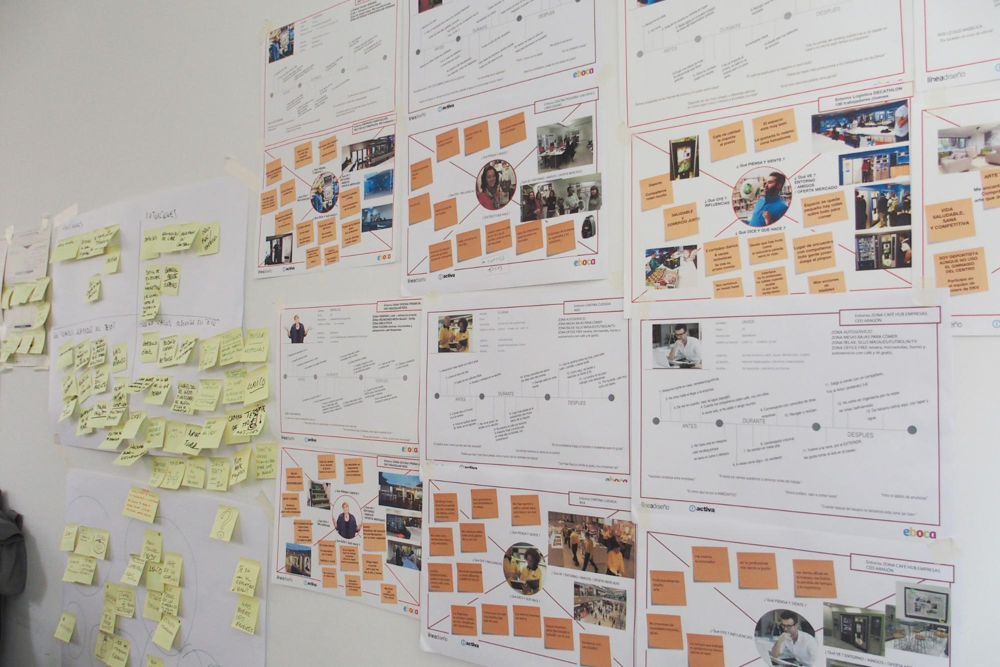

# Recursos  {#recursos3}

1- **El espacio de trabajo**: no requiere una gran transformación del aula.

2-** Material**: Nos servimos de él para construir. También para pensar, crear, representar, visualizar y tangibilizar soluciones.

3- **Personas:** dinamizadores y aliados.

4- **Equipo:** organizarse y comunicarse.

### 1- El espacio de trabajo: 

**Un aula puede ser el mejor de los espacios.**

Un aula es el sitio ideal, sea como sea, es su espacio, su contexto habitual.

Podemos mover mesas y sillas según las necesidades que tengamos. Juntar las mesas para hacer mesas más grandes siempre es una buena idea.

Una biblioteca o un taller también son buenos puntos de partida para montar un espacio diáfano, abierto...

**Si puede ser de pie.**

Es ideal que los alumnos puedan trabajar de pie.

La experiencia nos dice que cuando estamos de pie estamos más activos.

En el momento que nos sentamos nos “acomodamos” y no estamos tan receptivos.

**Pared, ventanas, paneles o corcho**

Para visualizar las ideas es muy útil poder colocar el material visual que vamos generando en el plano vertical. Todos podemos ver lo que hemos ido haciendo y podemos completar la información de una manera directa (con notas adhesivas, por ejemplo)

Por otro lado es importante ir viendo todo el proceso, y al final del mismo poder observar los pasos, los hitos, como se ha ido construyendo la idea en equipo.

Una solución, si no hay espacio libre, es colocar tableros apoyados en la pared para que cada equipo tenga su espacio de trabajo en el plano vertical.

### 2- Material.

Necesitamos básicamente:

**Material de soporte para visualizar datos e ideas:**

Papel A4 y A3 (puede ser perfectamente papel en sucio)

**Notas adhesivas**

Son opcionales, aunque nos permiten:

*   Sintetizar las ideas (una idea, una nota adhesiva)
*   Mover las ideas por el espacio de trabajo
*   Clasificar, organizar, ordenar las ideas o conceptos de forma rápida

Podemos hacer nuestras notas adhesivas “caseras” con papel ya utilizado por una cara y pegarlas con celo o blu tack.

**Rotuladores** 

Facilitan que hagamos dibujos o escribamos textos de forma directa, más espontánea.

Son ideales los rotuladores de tinta con base de agua, que son de secado rápido.

El alumnado está habituado a hacer bocetos, a hacer primero los dibujos a lápiz y luego pasarlos a rotulador… hábitos que han adquirido para hacer trabajos definitivos, que van a ser presentados.

Ahora el objetivo al dibujar es diferente. Priorizamos la comunicación de ideas por medio de esquemas o dibujos sencillos. Los rotuladores no nos permiten borrar y nos fuerzan a ser más espontáneos, facilitando la creatividad.

**Algunas ideas sobre cómo usar una nota adhesiva:**

Escribir el texto en mayúsculas o letra legible a buen tamaño

Escribir frases cortas, palabras clave, poco texto

Hacer categorías por colores

Hacer dibujos o esquemas explicativos

**NOTA: Durante esta lectura nombraré alguno de los recursos, herramienta o actividades que verás en los bloques 4 y 5, por lo que no me detendré en ellas.**

<!--Si clicas en la palabra correspondiente a la herramienta o actividad, que estará en cursiva, verás que te enlaza con el apartado correspondiente donde encontrarás la explicación; por si en ese mismo momento quisieras profundizar.-->

<!--JOSÉ, AQUÍ DIGO LO DE LOS ENLACES A LAS HERRAMIENTAS -->

**Material para construir prototipos:**

Plastilina para hacer prototipos rápidos (no arcilla ni similar)

Material reciclado: cartones, periódicos, cualquier material del que se disponga: telas, alambre…

Material opcional: piezas de construcción, una pizarra, papel continuo, personajes recortables, Scenes <!--(ENLACE PRESENTACIÓN 2 BLOQUE 5) …-->

### 3- Personas:

**Equipos** de 5 o 6 integrantes.

**Lo ideal sería que hubiera un dinamizador o facilitador por equipo** de 5-6 alumnos y alumnas, o al menos dos docentes facilitando la actividad en el aula.

Es una persona entrenada en la metodología que resuelve dudas, anima a realizar el trabajo en un tiempo concreto y posibilita la participación de todos los miembros del equipo.

Además, si es necesario, explica las herramientas al equipo, ayuda a enfocar el reto, busca el consenso en la toma de decisiones, desbloquea, motiva y coordina.

Los **dinamizadores** o facilitadores de la metodología pueden ser docentes de tu departamento u otro departamento. También pueden ser alumnos y alumnas de otros cursos que ya conozcan la metodología y puedan facilitar el trabajo, siempre que no asuman un rol protagonista y su forma de proceder y comunicarse sea discreta, sin el propósito de ejercer influencia.

El dinamizador debe preparar la dinámica haciendo una escaleta de tiempos para controlar la duración de cada una de las tareas o pasos a seguir durante la sesión.

El adulto que participe en esta dinámica debe estar dispuesto a aprender y a transmitir al alumnado que para él el proceso también supone un aprendizaje.

**Aliados**: Cuanto más compartamos el tema, proyecto, etc. con otras personas más aprenderemos. Es útil abrir el aula al exterior y facilitar las visitas de personas que cuenten su experiencia, de alumnado egresado, así como de familiares y amigos.

### 4- Equipo.

**Necesidades**:

Debe tener un **nombre**, poder identificarse.

Debe tener algún **medio para comunicarse** y compartir información durante el proyecto, curso escolar, etc. (correo, pared o tablón de referencia durante todo el proyecto, red social, plataforma de proyectos)