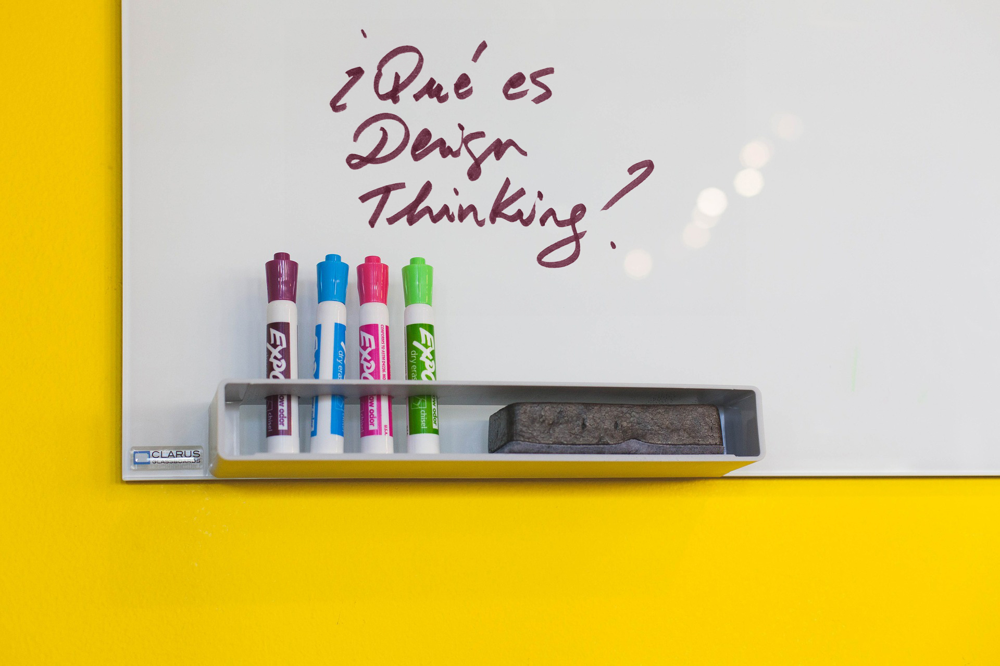

# Resultados. Casos de éxito3: {#resultados-casos-de-xito3}

He realizado una selección de algunas de las actividades que han sido más satisfactorias, tanto para los facilitadores como para docentes y alumnado, de entre las realizadas dentro de la iniciativa formativa ¡WOW! Diseño, y de las que tengo recogido material visual del proceso y de los resultados obtenidos.

Crea con Tangram

Visitas guiadas exposición EXPLORA 2019

Durante cinco mañanas estuvimos realizando talleres con alumnado de 2º ESO a 4º ESO de diferentes centros educativos de Aragón.

Las claves de la actividad:

El alumnado propone el tema de trabajo:

Cuestiones relativas al cuidado de los animales domésticos, patologías como la esquizofrenia, las discotecas, la seguridad en las obras de construcción en la ciudad, la seguridad en los hogares, los videojuegos, etc., son temas que interesan a los jóvenes.

Si trabajan en un tema que les interesa o incluso les ocupa, profundizan más en la actividad, ya que trabajan sobre soluciones a cuestiones que conocen o que les parecen importantes. Y sobretodo, son temas suyos, no impuestos o propuestos por un adulto.

Hinchables salvavidas para barcos, una mochila más cómoda, el logo para una discoteca, un parque para mascotas, charlas para concienciar sobre el cuidado de mascotas, actividades en los colegios con animales, sistemas de protección de las viviendas, juegos para ayudar a niños esquizofrénicos, libro para mostrar a los niños los peligros del fuego, un videojuego que te hace más empático, un crucero sostenible y educativo para toda la familia…; estos son algunos de los productos o servicios que han ideado y prototipado durante el taller.

El docente se integra en un equipo:

Durante el taller, el docente o los docentes acompañantes se integran en un equipo.

Son advertidos de que durante 50 minutos son uno más en el equipo. Su opinión no es más importante que las otras, todo se decide por consenso.

Si lo prefiere, el docente puede experimentar, como participante, el rol del facilitador.

Si el docente entra en la dinámica y se integra en el grupo puede: colaborar con el alumnado en la realización del prototipo, ayudar a desarrollar la idea, opinar…

Deja en manos del equipo el ritmo del trabajo, las decisiones y la profundización en el desarrollo del concepto; aprende a conformarse con lo que los alumnos pueden hacer sin imponer su nivel de conocimiento y su destreza.

Todo en 50 minutos:

Y todo esto en 50 minutos!

El facilitador o facilitadora del equipo se asegura que el equipo vaya tomando decisiones a buen ritmo. Creemos que es importante experimentar el trabajo en equipo para la realización de tareas con tiempo limitado. De esta forma, se toman decisiones más deprisa, se debate menos, se distraen menos.

Es gratificante experimentar lo que en equipo somos capaces de generar en menos de una hora. El que el alumnado pueda presentar su idea por medio de un prototipo permite que la actividad sea vista como un “logro”, es un reto, casi un milagro, que hayamos podido trabajar tanto en tan poco tiempo.

Aprenden metodología mientras se divierten:

El taller es un medio para que la metodología colaborativa se vaya interiorizando, para que los principios se vayan experimentando, para entrenar habilidades como la capacidad de analizar y sintetizar, diverger y converger, seleccionar un reto, ceder, sentir las ideas como del equipo, etc.

Pero todo esto se interioriza de una forma natural, mientras se hace, mientras se experimenta. Las risas, las bromas, las ideas locas, son totalmente compatibles con el trabajo creativo en equipo.

NOTA: Con la aplicación de este tipo de experiencias no se obtiene en el grupo de estudiantes un resultado inmediato, pero si se les muestra una vía de trabajo que se complementa con la que han podido experimentar al aplicar el proceso tecnológico o el proceso creativo.

Es una experiencia que no debería darse de un modo aislado sino formar parte de un plan, de una estrategia, para dotar a los estudiantes de las habilidades necesarias para resolver problemas en equipo. Podría formar parte de un ramillete de técnicas, herramientas, proyectos; con los que trabajar en el aula esta forma creativa de abordar retos.

El objetivo de la actividad no es diseñar un objeto, sino resolver un problema o aportar un alternativa. La solución se puede concretar en el diseño de un producto, un servicio, una experiencia, etc.

Talleres:

IES Pablo Serrano

Taller: Diseño de cubertería para personas con problemas de agarre.

2017-2018

Asignatura: Dibujo

4º ESO

Zaragoza

Las claves de la actividad:

Docente motivada

Cuando integramos este tipo de dinámicas en el aula, la motivación e involucración del docente en las mismas es clave para su éxito. Si el alumnado ve interesado e integrado al docente es más probable que se interese y participe activamente en la actividad.

Si el docente prefiere no integrarse en un equipo de trabajo, se convierte en una figura de apoyo, que puede facilitar material, aclaraciones o ayuda técnica, o puede hacer fotos para recoger el proceso y reflexionar a posteriori con el alumnado sobre el mismo haciendo una evaluación.

Grupo heterogéneo

Que el grupo de alumnos y alumnas esté formado por personas muy distintas puede convertirse en una ventaja. Es labor del profesorado componer los equipos de la forma más equilibrada posible. No es tarea fácil, pues hay que tener en cuenta no solo el expediente académico, sino cuestiones relativas al carácter o la personalidad.

Digo que es una ventaja porque la mezcla de puntos de vista a la hora de analizar los temas o retos siempre es muy enriquecedora. Y en este caso lo fue.

La profesora nos facilitó información sobre el alumnado (dificultades de aprendizaje, problemas de idioma, etc.) ayudándonos a adaptar la actividad.

Confianza

La confianza en el proceso, en las personas, en los facilitadores, es clave para minimizar las tensiones que pueden originarse cuando algo nuevo comienza.

Se trata de una dinámica en la que todos aprendemos, todos podemos tener dudas, y la confianza hace que se resuelvan los conflictos o las incertidumbres con creatividad.

Facilitación de la metodología

Las personas que facilitaron la metodología a los equipos fueron flexibles y se supieron adaptar a las limitaciones de idioma, que por ejemplo tenían algunos alumnos y alumnas; acercándose, comunicándose con respeto y paciencia.

“Guantes de la empatía”

La utilización de los guantes que simulan problemas de agarre fue muy bien recibida por el alumnado.

La curiosidad que generaron al principio fue poco a poco tornándose en interés por comprender las limitaciones de aquellos que no pueden coger los utensilios con facilidad.

Experimentar, ponerse en la piel de otras personas, entender las dificultades por las que pasan en su día a día, permite que el alumnado se motive por crear soluciones que ayuden, que ofrezcan una alternativa.

NOTA: Son interesantes las experiencias en las que los y las jóvenes buscan soluciones para otras personas, para colectivos con dificultades (mayores, discapacitados, etc.), ya que se colocan en otra perspectiva.

IES Pirámide

Taller: Re-diseño de mando de tv.

2019-2020

Asignaturas: Tecnología y Dibujo

1º Bachillerato

Huesca

Las claves de la actividad:

Coordinación profesorado

Desde el profesorado estuvo todo organizado y coordinado a la perfección: trabajo previo, material, implicación del profesorado que asistía a la dinámica, etc.

Tanto desde el departamento de dibujo como desde el de tecnología se trabajó previamente la actividad.

Trabajo previo

El alumnado, que cursaba las asignaturas de dibujo y tecnología, trabajó el tema u objeto del proyecto previamente en el aula por medio de la visualización de un video de introducción y un juego interactivo que muestran las claves del diseño de producto.

Actividad STEAM

La actividad evidenció la relación que se establece en un proyecto real entre la visión tecnológica,  la creativa y representativa. La tecnología está al servicio de las personas, hace posible soluciones que facilitan el uso de los productos; por otro lado, las soluciones se imaginan, se visualizan, se hacen tangibles, por medio del dibujo: esquemas, bocetos, vistas…

Todo se orquesta durante el proyecto de forma lógica y ordenada: primero las necesidades de las personas, luego las soluciones y su visualización.

NOTA: Este tipo de taller para diseñar una cubertería, un mando de tv, o cualquier objeto de uso cotidiano que sea fácil de prototipar (por tamaño y complejidad) es una oportunidad para conocer mejor al grupo de alumnas y alumnos por parte del docente y para potenciar el trabajo en equipo y desarrollar la empatía.

Es muy importante la figura del facilitador, que hace posible una atención personalizada de cada uno de los equipos. Para cuatro equipos de 5-6 alumnos pueden trabajar dos facilitadores, si son experimentados. Cada facilitador puede llevar dos equipos (un total de 12 personas)

Si estás interesado en llevarlo a cabo puedes coordinarte con otro docente de tu departamento o de otro departamento y unir las clases. Solo necesitáis dos clases de 50 minutos seguidas para poder realizarlo.

Proyectos:

IES Pablo Serrano

Proyecto: Re-diseño ratón de ordenador

2016-17

Asignaturas: Dibujo y Tecnología

1º Bachillerato

Zaragoza

Las claves de la actividad:

Implicación profesorado y coordinación entre departamentos y asignaturas (proyecto STEAM)

La implicación de los departamentos de Dibujo y Tecnología fue clave. Las dos docentes encargadas del proyecto se involucraron en el mismo y prepararon material para trabajar previamente con el alumnado.

Fue un proyecto coordinado en el que el alumnado trabajó en ocho sesiones conmigo en el aula de tecnología, en el aula con sus profesoras, y esporádicamente en casa para terminar algún dibujo o maqueta.

La profesora de tecnología preparó una clase previa en la que se analizaron los componentes internos de un ratón de ordenador (objeto a re-diseñar durante el proyecto) y la profesora de dibujo hizo una presentación sobre las tendencias formales de los ratones de ordenador en el mercado.

Por mi parte preparé una presentación visual de apoyo para todo el proceso.

Interés del alumnado

El alumnado mostró capacidad de trabajo e interés por el aprendizaje de la metodología y las herramientas de diseño.

Durante más de dos semanas estuvieron inmersos en el proyecto.

Expresaron su interés por algunas dinámicas (analizar-sintetizar) que consideraban podían aplicar en cualquier proyecto, incluso para estudiar.

Análisis /Síntesis/Reto

Se hizo especial hincapié en la primera fase del proceso. A partir de una investigación dada por medio de una presentación visual (mercado, tendencias, ergonomía, usuario, contexto de utilización, etc.), el alumnado elaboró las conclusiones principales hasta llegar a un reto individual.

Esta dinámica, que fue recibida por el alumnado sin mucho interés inicial, considerada árida o más aburrida, finalmente le permitió interiorizar un cambio de mirada respecto a la disciplina de diseño; considerada inicialmente como una disciplina más superficial, el alumnado llegó a visualizar lo que podía aportar desde el inicio del proceso.

Proceso realista

Bocetos a mano alzada, herramientas de valoración, brainstorming, técnicas de representación específicas de diseño de producto, maquetación de paneles de presentación...; el alumnado pudo aprender y practicar el trabajo de especialistas en diseño de producto.

Exposición y reportaje:

El profesorado preparó una exposición en el hall de entrada del instituto para mostrar el resultado del proyecto y el proceso que se había llevado a cabo.

Un programa de la televisión aragonesa integró la crónica del proyecto en un reportaje sobre diseño y visitó el centro. El profesorado y el alumnado intervinieron contando cómo había sido la experiencia y mostraron los prototipos.

NOTA: Este proyecto está especialmente indicado para alumnado de bachillerato, que ya está enfocado en sus estudios superiores y quiere aprender más sobre cómo se trabaja en el contexto empresarial o social.

Aporta una metodología colaborativa, reflexiva, que complementa, en su última etapa en el instituto, los contenidos técnicos que están trabajando en el aula.

IES Andalán

Proyecto: Diseño de recuerdo del centro (impresora 3D)

2017-2018

Asignatura: Tecnología

2º Bachillerato

Zaragoza

Las claves de la actividad:

Coordinación del rol técnico y de facilitación de la metodología

El profesor encargado del proyecto, con muchos años de docencia a sus espaldas, pero la ilusión por aprender intacta, fue un gran aliado durante el proyecto.

Experto en impresión 3D, entendió desde el principio que le podíamos aportar una metodología para poder proponer a su alumnado de bachillerato un proyecto real, desde la necesidad hasta el producto fabricado.

Conocimiento técnico y conocimiento metodológico se dieron la mano en una simbiosis que repercutió en la calidad del proyecto y en lo que el alumnado pudo aprender de la experiencia.

Trabajo en equipo

Combinamos trabajo individual y en equipo. Investigación grupal, generación de ideas individual, puesta en común, decisión grupal, mejora del producto grupal, etc.

Combinar las dinámicas permite que todos los miembros del equipo trabajen, cada uno a su nivel y a su ritmo.

Selección de la idea

Una vez que cada equipo tenía preparada una propuesta de objeto se realizó una presentación, que coincidió con nuestra última visita. El objetivo de la presentación era elegir una de las tres ideas que se habían definido hasta el momento.

Utilizamos una tabla de valoración como herramienta para tomar la decisión.

La madurez del alumnado y la utilización de la herramienta, que hacía más objetiva la decisión, hizo posible que se eligiera una propuesta de una forma ágil.

El objeto seleccionado, ya definido en el software de construcción de sólidos, fue un llavero, objeto que los estudiantes de segundo consideraban útil.

Tenía como peculiaridad su forma, basada en el logotipo del instituto.

Hasta la implementación

Durante las ocho sesiones que trabajamos con el alumnado pudimos llegar a definir un producto a imprimir con impresora 3D.

El tema de trabajo fue el diseño y fabricación de un recuerdo para entregar a los alumnos que terminaban segundo de bachillerato. El equipo de tecnología se encargaba de diseñar el recuerdo, para todos los compañeros de segundo de bachillerato, que se les haría entrega a final de curso.

Durante el proceso, y una vez definido el concepto y dibujado en un programa de ordenador gratuito de construcción de sólidos por cada uno de los participantes, se eligió uno de los conceptos para su desarrollo final.

El objeto seleccionado tenía cierta complejidad técnica, ya que se componía de varias piezas de varios colores que se montaban dando lugar al producto final.

La base era azul y se completaba con tres pequeñas piezas blancas que simbolizaban, mediante su forma, los conocimientos adquiridos en los tres bachilleratos: artístico, de ciencias y de humanidades; dando lugar a tres modelos diferentes de llavero.

NOTA: Los alumnos y alumnas de primero o segundo de bachillerato que cursan tecnología y que aspiran a estudiar ingeniería, arquitectura o alguna carrera técnica encuentran en un proyecto de diseño (en el que se hace énfasis en las necesidades de las personas, en la capacidad creativa de los equipos y en la posibilidad de construir prototipos e ir mejorando la idea), un complemento ideal a los conocimientos técnicos que han ido adquiriendo.

Además, el hecho de trabajar con perfiles creativos como el de diseño les ofrece la posibilidad de entender lo que cada especialidad puede aportar y valorar otras perspectivas o miradas; cuestión que no es baladí para cualquier persona que pretenda integrarse en un equipo técnico en el sector industrial, por ejemplo.

IES Pedro de Luna

Proyecto: Design Thinking y participación

2016-17 - 2018-19

Asignaturas: Desarrollo de Capacidades

2º ESO

Zaragoza

Las claves de la actividad:

Design Thinking

El instituto Pedro de Luna de Zaragoza tiene un proyecto de desarrollo de capacidades. Durante tres cursos consecutivos se han realizado proyectos de Design Thinking con los alumnos y alumnas participantes.

El proyecto no pertenece a ninguna asignatura, sino que es una experiencia que pretende aportar un plus formativo y experiencial a un grupo de alumnos y alumnas interesados en aprender.

Esta característica permite que el alumnado tenga la libertad suficiente para plantear sus propios temas de estudio o trabajo.

Realizar un proyecto mediante la metodología Design Thinking es una oportunidad para todos: docentes encargados, facilitadores y alumnado; de aprender haciendo.

Participación

He trabajado con tres grupos de alumnos diferentes durante tres años consecutivos.

En todas las ocasiones el trabajo ha resultado muy interesante y también exigente.

Se trata de grupos de alumnos por lo general muy participativos y proactivos. 

La dificultad en la facilitación de este proyecto estriba en la coordinación entre el centro y los dinamizadores y en calibrar el papel que asume el alumnado (Ver escalera de participación infantil de Roger Hart)

Los proyectos más interesantes y enriquecedores para todos son aquellos en los que el alumnado propone los retos y llega a prototipar las soluciones o propuestas sobre un tema que es de su interés y lo presenta al centro: temas sociales, medioambientales, relacionados con la convivencia en el centro, etc. En esos casos, son ellos los que guiados por facilitadores, que les ayudan a conocer y aplicar las herramientas de design thinking, construyen su propuesta.

Proceso

La duración del proyecto hace que evitar la pérdida de interés del alumnado sea una tarea más ardua. Este se ve inmerso en un trabajo que no obtiene un resultado tangible al momento.

El interiorizar las fases de diseño e ir experimentando el proceso con la ayuda de las facilitadoras puede resultar “agotador”, ya que en las fases iniciales se realizan tareas como: analizar, investigar, sintetizar, etc., que requieren mucha concentración y perseverancia y a penas podemos visualizar los avances que vamos haciendo hasta que llegamos a la generación de ideas.

Por todo esto es importante ir ajustando las herramientas, su grado de dificultad, profundización, etc. al nivel de esfuerzo y expectativas del alumnado.

Relación con la comunidad educativa

Durante estas dinámicas participativas el alumnado siente la necesidad de salir del aula, preguntar a sus compañeros, profesores, en definitiva, relacionarse con la comunidad educativa para proponer soluciones e intentar conseguir apoyos.

Es importante, antes de comenzar el proyecto conocer el grado de implicación de Dirección, profesorado y familias, para no generar un caldo de cultivo en el que crear soluciones que no se puedan abordar o implementar finalmente.

Definir un pequeño documento de normas, especificaciones, etc. puede ayudar a que el alumnado sepa cuál es su “terreno de juego”.

NOTA: Considero que este tipo de proyectos deben enmarcarse en procesos de participación, de co creación y co diseño del entorno y los procesos que sustentan la experiencia de aprendizaje en los centros educativos, de forma que la participación del alumnado se formalice, se paute y sea una realidad.